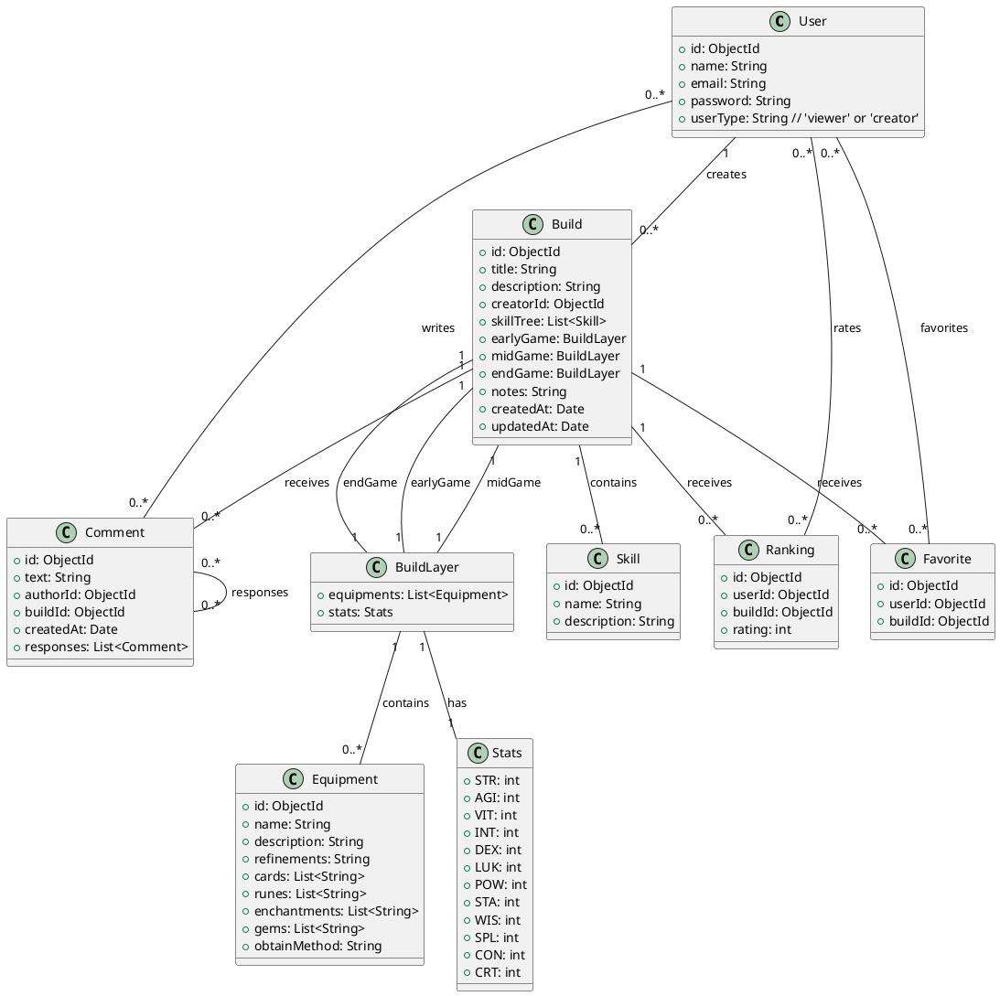

# Documento de Requisitos do Sistema

## Índice

1. [Visão Geral](#visão-geral)
2. [Requisitos Funcionais](#requisitos-funcionais)
   1. [Usuários](#usuários)
   2. [Builds](#builds)
   3. [Comentários](#comentários)
   4. [Rankings](#rankings)
   5. [Favoritos](#favoritos)
3. [Requisitos Não Funcionais](#requisitos-não-funcionais)
4. [Modelo de Dados](#modelo-de-dados)
   1. [Diagrama UML](#diagrama-uml)
   2. [Esquemas de MongoDB](#esquemas-de-mongodb)
5. [Casos de Uso](#casos-de-uso)
   1. [UC1: Visualizar Build](#uc1-visualizar-build)
   2. [UC2: Criar Build](#uc2-criar-build)
   3. [UC3: Favoritar Build](#uc3-favoritar-build)
   4. [UC4: Rankear Build](#uc4-rankear-build)
   5. [UC5: Comentar em Build](#uc5-comentar-em-build)
   6. [UC6: Responder Comentário](#uc6-responder-comentário)
   7. [UC7: Editar Comentário](#uc7-editar-comentário)
   8. [UC8: Deletar Comentário](#uc8-deletar-comentário)
   9. [UC9: Login](#uc9-login)
   10. [UC10: Logout](#uc10-logout)

---

## Visão Geral

O sistema de compartilhamento de builds de Ragnarok é uma aplicação web destinada a jogadores que desejam visualizar, publicar, favoritar, rankear e comentar builds de personagens. A aplicação centraliza informações de builds de diferentes servidores, proporcionando uma experiência mais organizada e acessível do que as wikias individuais.

---

## Requisitos Funcionais

### Usuários

- **RF001**: O sistema deve permitir que usuários visualizem builds sem necessidade de cadastro.
- **RF002**: O sistema deve permitir que usuários se cadastrem como criadores de builds.
- **RF003**: O sistema deve permitir que usuários façam login para acessar funcionalidades adicionais (criar builds, favoritar, comentar, rankear).
- **RF004**: O sistema deve permitir que usuários criadores de builds editem e excluam seus próprios builds.
- **RF005**: O sistema deve permitir que usuários comentem em builds.
- **RF006**: O sistema deve permitir que usuários editem e excluam seus próprios comentários.
- **RF007**: O sistema deve permitir que usuários respondam a comentários.
- **RF008**: O sistema deve permitir que usuários façam logout do sistema.

### Builds

- **RF009**: O sistema deve permitir que criadores de builds criem novas builds, especificando título, descrição, árvore de habilidades, equipamentos e status para as camadas Early Game, Mid Game e End Game.
- **RF010**: O sistema deve permitir que criadores de builds adicionem anotações às builds.
- **RF011**: O sistema deve exibir builds com detalhes organizados por camadas (Early Game, Mid Game, End Game).
- **RF012**: O sistema deve permitir que builds sejam associadas a um criador específico.

### Comentários

- **RF013**: O sistema deve permitir que usuários façam comentários em builds.
- **RF014**: O sistema deve permitir que comentários tenham respostas, formando uma conversa.

### Rankings

- **RF015**: O sistema deve permitir que usuários deem uma nota de 1 a 5 estrelas para as builds.

### Favoritos

- **RF016**: O sistema deve permitir que usuários favoritem builds para acesso rápido futuro.

---

## Requisitos Não Funcionais

- **RNF001**: O sistema deve ser responsivo e funcionar em dispositivos móveis e desktops.
- **RNF002**: O sistema deve garantir a segurança dos dados dos usuários, utilizando criptografia para senhas.
- **RNF003**: O sistema deve ter alta disponibilidade e ser capaz de lidar com um grande número de acessos simultâneos.
- **RNF004**: O sistema deve ser escalável, permitindo a adição de novas funcionalidades no futuro.
- **RNF005**: O sistema deve ter um tempo de resposta rápido, garantindo uma boa experiência do usuário.

---

## Modelo de Dados

### Diagrama UML

